# Assignment 3

## Project Demostration

Application running on [heroku](https://cs5610-ivt-00001.herokuapp.com/)

## Project Objective
This is the repository for CS5610 Web Development Assignment 3  
- Video presentation on [Youtube](https://youtu.be/SUQTMCJBBJo)

- Slides Presentation on [Google Slides](https://docs.google.com/presentation/d/1ktYqzd2cdytVNtC3GTLCio20ICUiTC_xPWYSIKATMUM/edit?usp=sharing)

## Investment Portfolio Tracker

## Feature
- User can login via Auth0 profile / Google account
- User can navigate their investment portfolio
- User can search stock symbol, system will return stock / Tweeter information
- User can perform simulated trading via the system

## System Design
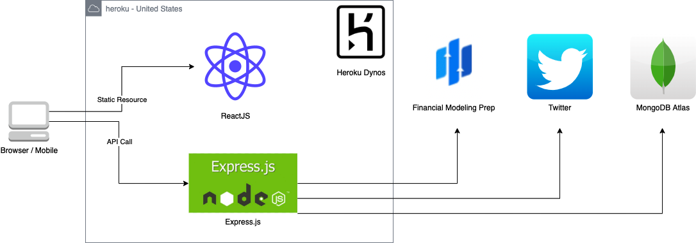

## External API 

\#      | Site            | Usage
------- | -------         | -------
| 1     | auth                  | User Authenication
| 2     | financialmodelingprep | Stock Data APIs
| 3     | twitter               | Live Tweet related to stock info

# Screen Dump
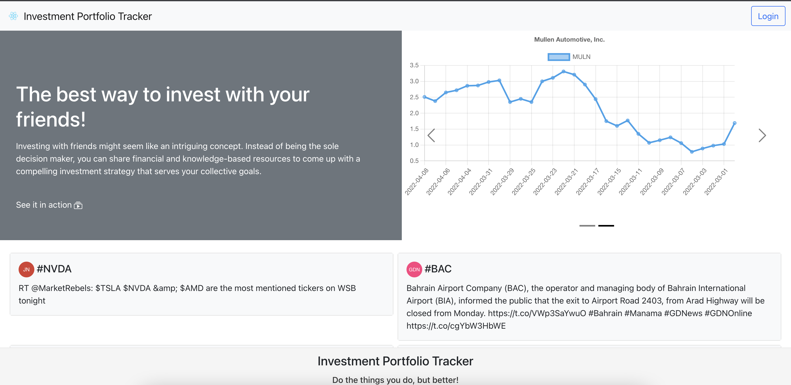
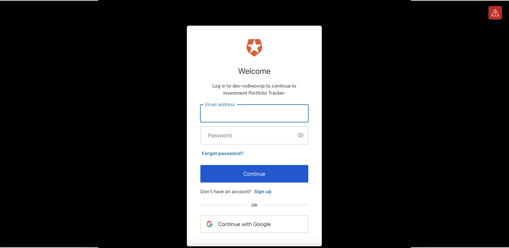
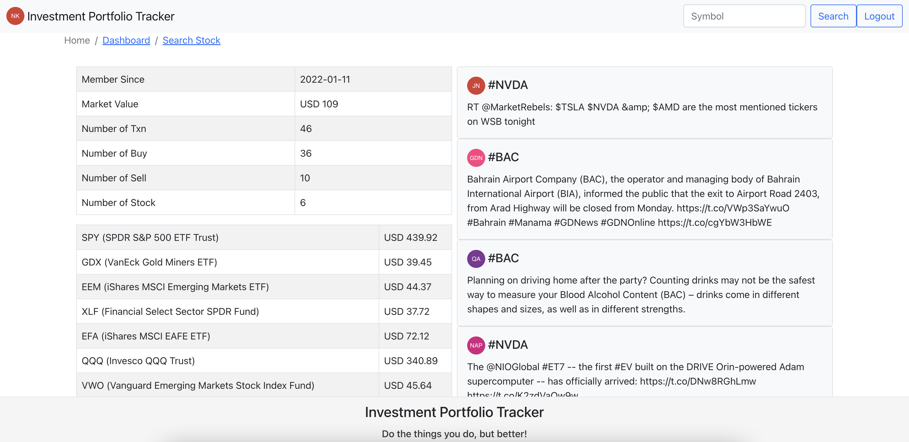
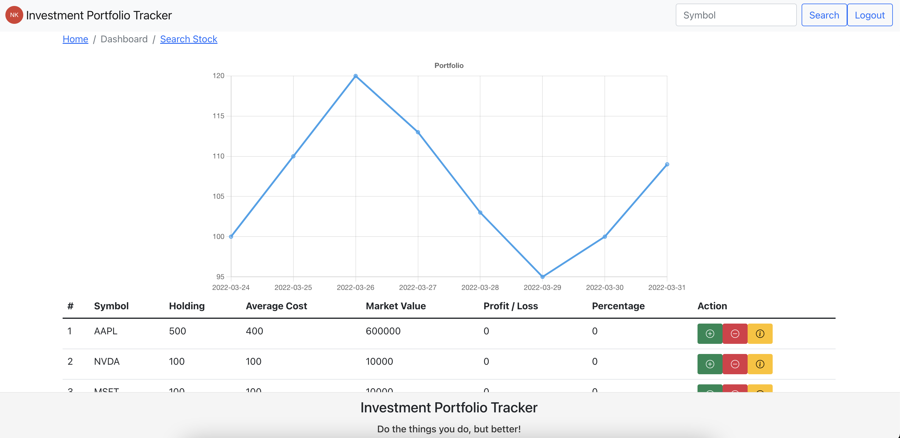
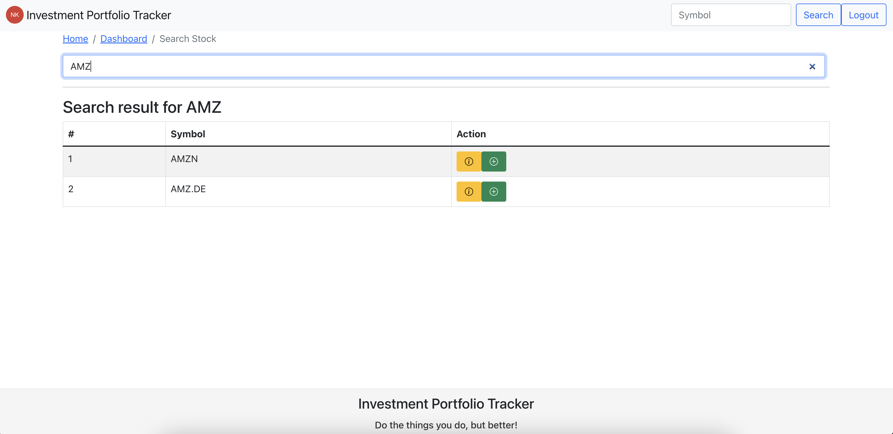
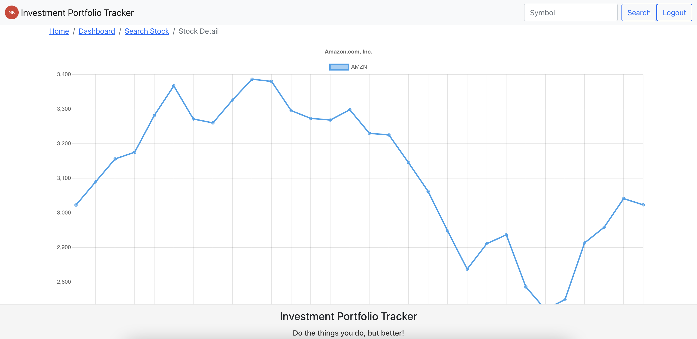

# Development
- npm start
- npm run build

# Heroku Deployment
git add .
git commit -am "Add new feature"
git push heroku main

<<<<<<< HEAD
# Accessibility Report
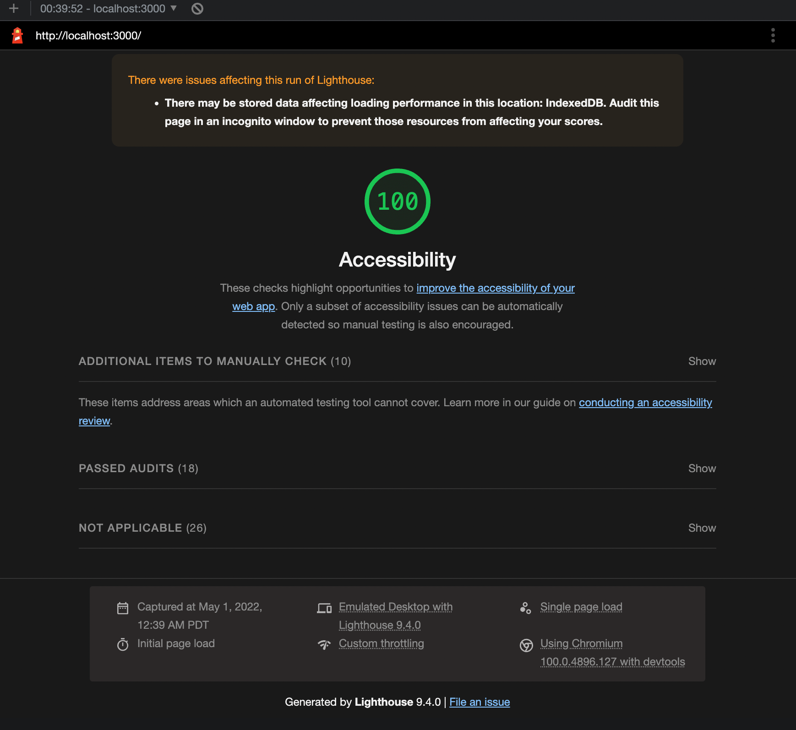
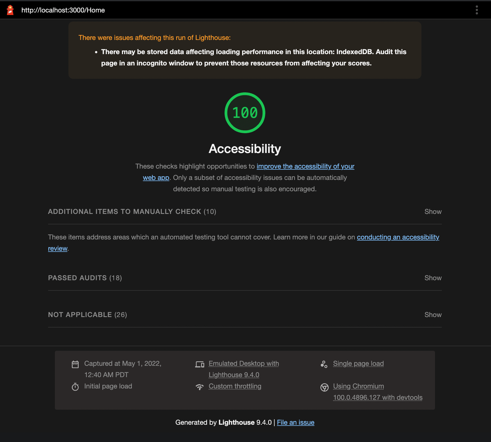
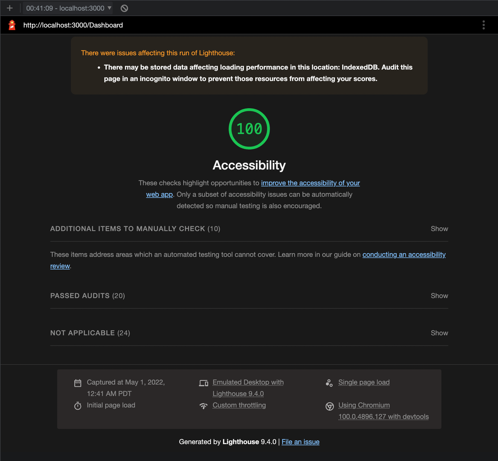
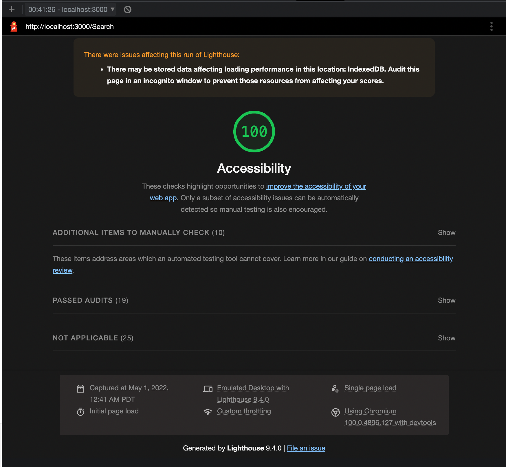
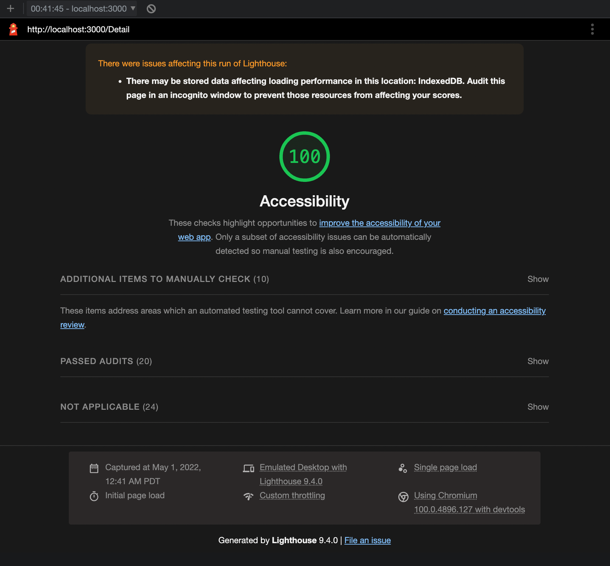

=======
>>>>>>> bac20e0ba3ee33439c295f444782118487fc85e1
## Project Requirement from Canvas

### Homepage
- The landing page of your web application. It is the first page users should see when they visit your website. 
- Must be mapped to either the root context ("/") or ("/home").
- Must display generic content for anonymous users. The content must be dynamic based on the latest data. For instance, you might display snippets and links to the most recent post, review, or member who recently joined
- Must display specific content for the logged-in user. The content must be dynamic based on the most recent data entered by the logged-in user. For instance, you might display snippets and links to the most recent post or review created by the logged-in user
- Must be clear to what the Web site is about and must look polished and finished

### Log in/Register page
- The login and register page allows users to register (create a new account) with the website and then log in later on
- Must force login only when identity is required. For instance, an anonymous user might search for movies and visit the details page for a particular movie without needing to log in. But if they attempt to like the movie, rate it, comment on it, write a review, or follow someone, the application must request the user to log in. Most of the Web applications must be available without a login 
- Must be mapped to /login if both login and register are implemented on the same page
- The login and register page can be implemented as a single page or as two separate pages. In that case, the login page must be mapped to /login and the registration page must be mapped to /register

### Profile page
- Users can see all the information about themselves. It could have several sections for personal information and links to related content associated with the user.  For instance, display a list of links to all the favorite movies, a  list of links of users they are following, etc.
- Must allow users to change their personal information.  
- Must be mapped to "/profile" for displaying the profile of the currently logged in user
- The profile page may be implemented as several pages (based on how you want to display the information)
### Search/Search Results page
- Search and results can be on the same page or in separate pages. (e.g. the search bar can be on the home page and the results on a separate page. Or both in a separate search page). 
- Users must be able to see a summary of the search results and navigate to a detail page that shows a detailed view of the result. 
- Must be mapped to /search when no search has been executed and no results exist
- Must be mapped to /search/{search criteria} or /search?criteria={search criteria} when a search has been executed  

### Details page
- The details page allows users to view a detailed view of the search result. They can see more information when they click on the search result. The details page must fulfill the following requirements.
- Must be mapped to /details/{unique identifier} or /details?identifier={unique identifier} where unique identifier uniquely identies the item being displayed

<!-- # Folder Create Command
mkdir -p assets/images
mkdir -p components
mkdir -p services
mkdir -p store
mkdir -p utils
mkdir -p views -->